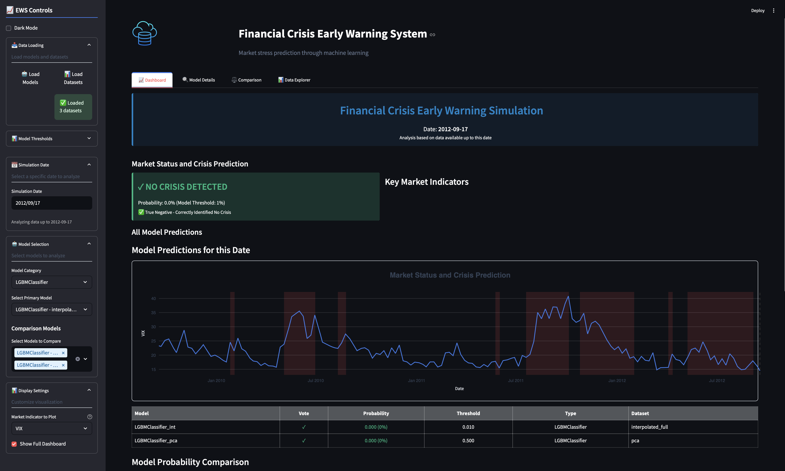

# Financial Crisis Early Warning System

This repository contains a comprehensive Financial Crisis Early Warning System with two main components: an analytical pipeline (Jupyter notebooks) for model development and a real-time monitoring dashboard.

## Project Overview

Financial markets typically generate positive returns over the long term, but periodically experience crisis events. This project applies data science and machine learning techniques to develop an early warning system that can detect potential financial crises 2-4 weeks before they fully materialize.

The approach treats normal market conditions ("risk-on" periods) as the baseline and crisis periods ("risk-off") as anomalies to be detected.

## Directory Structure

```
├── data
│   ├── raw             # Original, immutable data
│   └── processed       # Cleaned and processed datasets
├── models              # Trained model files
│   └── thresholds      # Optimized decision thresholds
├── notebooks           # Jupyter notebooks for analysis and model development
├── results             # Generated analysis results and figures
├── dashboard           # Streamlit dashboard for real-time monitoring
│   ├── assets          # Dashboard assets (images, styles)
│   ├── utils           # Utility modules for the dashboard
│   └── app.py          # Main dashboard application
└── README.md           # Project documentation
```

## Components

### 1. Analysis Pipeline (Notebooks)

The Jupyter notebooks contain the complete analytical process:

1. **Data Exploration**: Understanding statistical properties of indicators during normal vs. crisis periods
2. **Temporal Decomposition**: Separating time series into trend, seasonality, and residual components
3. **Feature Engineering**: Creating specialized financial indicators that capture market relationships
4. **Data Augmentation**: Interpolating weekly data to daily frequency (7,700+ datapoints)
5. **Feature Selection**: Creating four distinct feature sets through statistical, tree-based, and PCA methods
6. **Time Series Cross-Validation**: Implementing expanding window validation to prevent lookahead bias
7. **Model Development**: Training and evaluating multiple machine learning algorithms
8. **Performance Optimization**: Fine-tuning thresholds for early warning effectiveness

### 2. Real-Time Monitoring Dashboard

The Streamlit dashboard provides a user-friendly interface for:



- **Market Stress Monitoring**: Visual indicators of current market conditions
- **Model Selection**: Choose between different optimized models based on specific metrics (precision, recall, F1, AUC)
- **Probability Timeline**: Track crisis probability trends over multiple timeframes
- **Key Indicator Dashboard**: Real-time visualization of the most predictive market variables
- **Threshold Controls**: Customizable alert thresholds based on risk tolerance
- **Historical Comparison**: Compare current patterns with past crisis events

## Data Sources

The dataset contains financial market indicators from 2000 to 2021, including:

- Market indices (VIX, MSCI country indices)
- Commodities (Gold, Oil, Commodity indices)
- Currencies (Dollar index, JPY, GBP)
- Bond Yields (US, Germany, Italy, UK, Japan)
- Interest Rates (LIBOR, EONIA)
- Bond Indices (Corporate, High Yield, MBS, Emerging Markets)
- Economic Indicators (Baltic Dry Index, Economic Surprise indices)

## Key Results

- **Early Warning Capability**: Detection of crisis conditions 2-4 weeks in advance
- **High Precision**: Best models achieve 95%+ precision with minimal false alarms
- **Model Performance**: LightGBM on the full interpolated dataset achieved best F1 score (0.953)
- **Lead Time**: Median lead time of 21-23 days before crisis events
- **Key Predictors**: Volatility indicators, yield curve characteristics, and cross-asset correlations

## Setup and Installation

### Analysis Environment

1. Clone this repository
2. Create a Python virtual environment:
   ```
   python -m venv venv
   ```
3. Activate the virtual environment:
   ```
   # On Windows
   venv\Scripts\activate
   
   # On macOS/Linux
   source venv/bin/activate
   ```
4. Install required packages for notebooks:
   ```
   pip install -r notebooks/requirements.txt
   ```
5. Launch Jupyter:
   ```
   jupyter notebook
   ```

### Dashboard

1. Navigate to the dashboard directory:
   ```
   cd dashboard
   ```
2. Create a separate virtual environment for the dashboard (optional):
   ```
   python -m venv venv
   source venv/bin/activate  # On macOS/Linux
   # or
   venv\Scripts\activate  # On Windows
   ```
3. Install dashboard requirements:
   ```
   pip install -r requirements.txt
   ```
4. Run the dashboard setup script:
   ```
   bash run_dashboard.sh
   ```
5. Access the dashboard at http://localhost:8501
